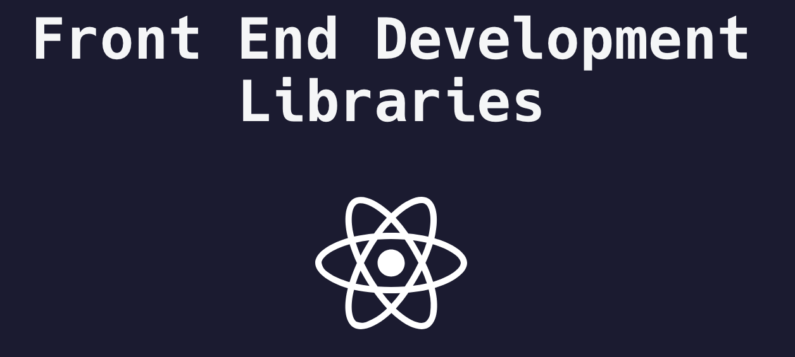

# Front End Development Libraries Projects FreeCodeCamp

source code in CodePen open <a href = "https://codepen.io/ardi-fajar-arifin" target="_black"> MyCodePen</a>
 
My <a href = "https://www.freecodecamp.org/certification/ardifjar443/front-end-development-libraries" target="_black">Certificate ehe</a>
 
list certification:
- Random Quotes Machine
- Markdown Previewer
- Drum Machine
- Calculator
- 25 + 5 Clockœ